What's so great about Ggplot2?
================
Sarah Hosking for \#R-Ladies Paris
9 November 2017

**Preface**

_This file was generated from an RMD file. It contains more written explanations than the original presentation, so it's easier to follow for non-attendees._

_To keep the focus on `Ggplot2` code, I have hidden the data munging code from the presentation._

_To see ALL code used in this presentation, see the source files on github:_ 
https://github.com/limegimlet/rladies_dataviz_nov2017.git.

It's all about *layers*
=======================

You can build plots like you would for this cake.


What's so great about layers?
=============================

-   Modular
-   Easier to read
-   They look good OOTB

If Ggplot2 is so easy, why this presentation?
=============================================

Once you get over the initial learning curve, it's all too easy during demos to go gaga showing off great-looking faceted plots with fabulous colour palettes and themes.

But after a few presentations I noticed what people talked to me about wasn't the fancier plotting techniques. It was a few fundamentals that stumped them.

Barriers to true Ggplot2 ❤
==========================

1.  Opaque terminology
2.  Untidy dataframes
3.  Unclear how to iterate

But before we dive into those ...

What data are we exploring?
===========================

Paris air quality!

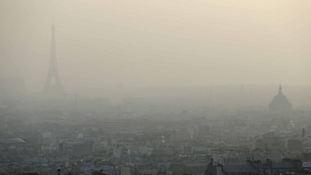

(Photo from Le Monde. <http://www.lemonde.fr/planete/article/2014/11/24/a-paris-la-pollution-est-aussi-nocive-que-le-tabagisme-passif_4528203_3244.html>)

Why not data that's, um, less of a downer?
==========================================

My audience is often Parisian. The air quality data is available for public download, and the internet already has enough plots about cars, irises and diamonds.

Moreoever, when I was really getting into Ggplot2 in late 2016, European headlines were dominated by stories of extreme pollution spikes from fine particulate matter.

And since I live between 2 major arterial roads in city center, my question was "Just how bad is it?" Also, being a runner and cyclist, I wanted to see if there was clearly a best time of day to exercise outdoors.

About the data set
==================


-   5 pollutants monitored
-   readings collected hourly, 24/7
-   from July 21 2011 to Oct 31 2017
-   measuring location: Paris Hôtel de Ville

``` r
nrow(airparif)
```

    ## [1] 55080

``` r
head(airparif)
```

    ##         date year month day hour PM10 PM25 NO2 O3 CO
    ## 2 2011-07-21 2011    07  21    1    7   NA  12 NA NA
    ## 3 2011-07-21 2011    07  21    2    6   NA  10 NA NA
    ## 4 2011-07-21 2011    07  21    3    7   NA  10 NA NA
    ## 5 2011-07-21 2011    07  21    4    7   NA  14 NA NA
    ## 6 2011-07-21 2011    07  21    5   10   NA  30 NA NA
    ## 7 2011-07-21 2011    07  21    6   10   NA  36 NA NA

The 5 pollutants being monitored are:

-   `PM25` = Particulate matter &lt; 2.5 µm
-   `PM10` = Particulate matter &lt; 10 µm
-   `NO2` = Nitrogen Dioxide (Azote)
-   `CO` = Carbon monoxide
-   `O3` = Ozone

Create the first layer
======================

Let's build a simple histogram of `PM10`.

``` r
# create data layer
ggplot(data = airparif, aes(x = PM10))
```

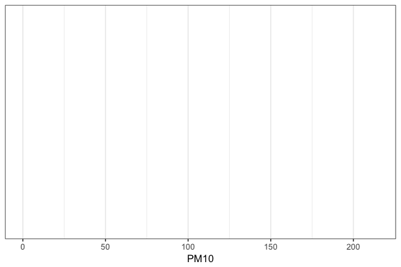

Hmmmmmm.....

Why is this blank?
==================

-   only told Ggplot2 *what* to plot, not *how*
-   nonetheless, x-axis is already nicely-formatted
-   next step: add a `geom` layer

Add a `geom`
============

``` r
# add plot-type layer
ggplot(data = airparif, aes(x = PM10)) + 
  geom_histogram()
```

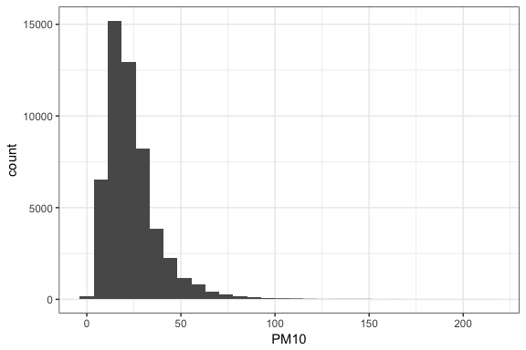

Voilà. But before we go further, let's clarify a few terms.

Opaque term 1: `aes()`
======================

Mental barrier \#1 for new(er) Ggplot2 users is `aes()`, called the *aesthetic*.

This term spooks people.

In plain English: `aes()` is where you ***map* data frame variables to visual elements**.

The most basic visual elements to any plot are the x and y axes. Other examples are `linetype`, `shape`, and `fill`.

Map visual elements to variables
================================

This tells Ggplot2 to change this visual element for each group.

Notice how this automatically generates a nice-looking legend.

``` r
# create data layer that maps
# a variable to fill colour
p <- ggplot(data = airparif, aes(x = PM10, fill = year))

p + geom_histogram()
```

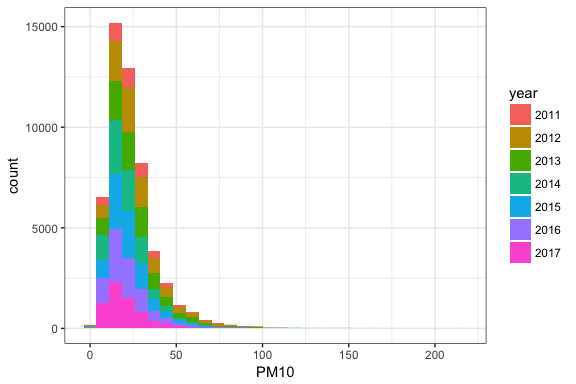

Before those with design backgrounds start hyperventilating, I've created a rainbow histogram *only to illustrate a point*. As a method to communicate data, it totally sucks.

Set a visual element
====================

By contrast, to change the look of the entire plot, you *set* a visual element to a value.

``` r
# create data layer, *without* fill=
p <- ggplot(data = airparif, aes(x = PM10))

# add plot layer & set fill color 
p + geom_histogram(fill = 'blue')
```

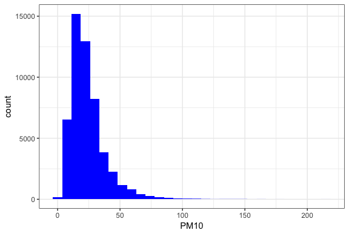

Opaque term 2: `geom_xxx()`
===========================

This refers to the geometric projection of your data.

In plain English, it means the plot type.

So we can easily swap another distribution plot layer (in this case, density plot) that will work with our existing data layer.

``` r
# create data layer *with* fill mapped to year
p <- ggplot(data = airparif, aes(x = PM10, fill = year))

# create density plot this time
p + geom_density()
```

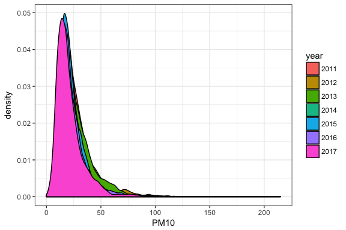

``` r
# make easier on eyes!
p + geom_density(alpha = 1/4, linetype = 0)
```

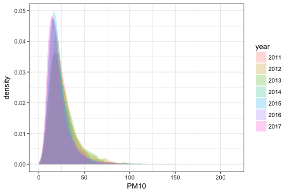

Tip 2: Use tidy data + facets
=============================

Why? Let's plot the distrubtion of another - NO2.

``` r
# plot another var distribution
p <- ggplot(data = airparif, aes(x = NO2))

p + geom_histogram()
```

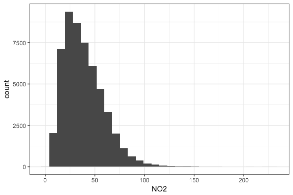

Now, imagine we had 20 pollutants in our data frame.

[](images/tedious.gif)

Instead, use *tidy* data.

Untidy vs Tidy
==============

*Not tidy*

    ##         date year month day hour PM10 PM25 NO2 O3 CO
    ## 2 2011-07-21 2011    07  21    1    7   NA  12 NA NA
    ## 3 2011-07-21 2011    07  21    2    6   NA  10 NA NA
    ## 4 2011-07-21 2011    07  21    3    7   NA  10 NA NA
    ## 5 2011-07-21 2011    07  21    4    7   NA  14 NA NA
    ## 6 2011-07-21 2011    07  21    5   10   NA  30 NA NA
    ## 7 2011-07-21 2011    07  21    6   10   NA  36 NA NA

*Tidy*

    ##         date year month day hour pollutant value
    ## 1 2011-07-21 2011    07  21    1      PM10     7
    ## 2 2011-07-21 2011    07  21    2      PM10     6
    ## 3 2011-07-21 2011    07  21    3      PM10     7
    ## 4 2011-07-21 2011    07  21    4      PM10     7
    ## 5 2011-07-21 2011    07  21    5      PM10    10
    ## 6 2011-07-21 2011    07  21    6      PM10    10

-   observations in rows
-   variables are columns
-   values in cells

Plot tidy data & facet
======================

The advantage of gathering your data into a tidy format is it generates categorical variables. In our case, `pollutant`.

Categorical variables are easy to group and facet in Ggplot2.

``` r
# create plot of data layer only
p.tidy <- ggplot(data = airparif.tidy, aes(x = value))
p.tidy
```


``` r
# add geom layer (a.k.a. the plot type)
hg <- p.tidy + geom_histogram()
hg
```


``` r
# add facet layer
hg + facet_wrap(~pollutant)
```


``` r
# assign facet wrap to a variable
# & fix ranges for x-axes
fw <- facet_wrap(~pollutant, scales = 'free_x')
hg + fw
```


Tip 3: Learn to iterate quickly
===============================

-   save layers as variables
-   update data layer with `%+%`

``` r
# display earlier histogram of NO2 only
p + geom_histogram()
```


``` r
# update plot var to use new tidy df & x var
p <- p %+% airparif.tidy + aes(x = value)
p + geom_histogram()
```


``` r
# add them together
p + 
  geom_histogram() +
  fw
```


``` r
# map fill to pollutant
p <- p %+% aes(fill = pollutant)
p +
  geom_histogram() +
  fw
```


The original plot for a single histogram required 2 lines of code.

Here we've created 5 histograms using 3 lines of code.

Another example: switch to boxplots
===================================

How do distributions change from month to month?

``` r
# update data layer to plot values by *month*
# and add a y variable.
p <- p %+% aes(x = month, y = value)

# add boxplot & facet layers
bp <- p + geom_boxplot()
bp + fw
```

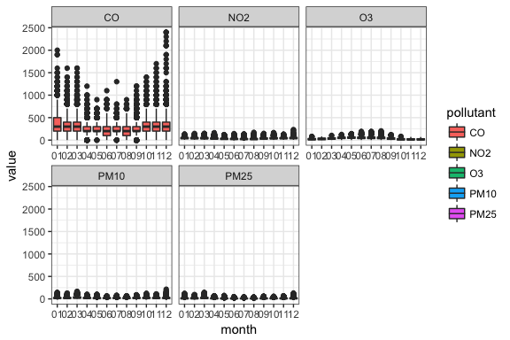

``` r
# update fw var to free y-axis!
fw <- facet_wrap(~pollutant, scales = 'free_y')

# try again
bp + fw
```

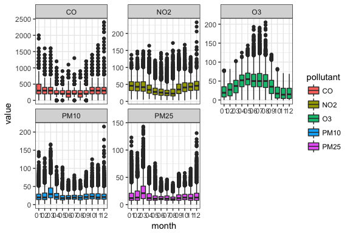

``` r
# change to *hourly* boxplot
bp <- bp %+% aes(x = as.factor(hour))

bp + fw
```

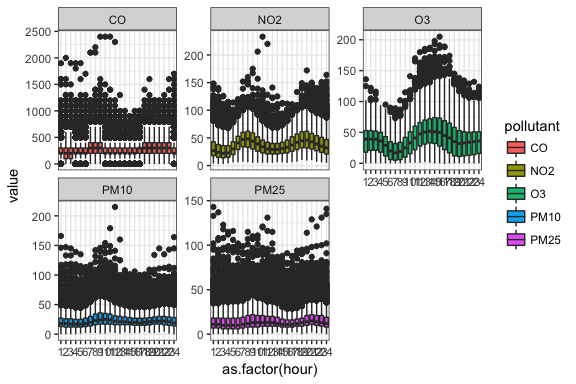

Quite frankly, these outliers look scary, particularly for carbon monoxide & nitrogen dioxide. But the values alone don't mean anything to me. I need context.

Add context by adding data
==========================

So just how bad are these outliers, the pollution spikes?

To answer that question, I'd like to add horizontal lines showing the low-med-high-very high thresholds. These are different for each pollutant.

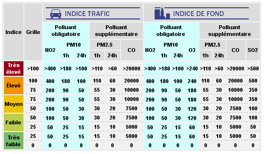

``` r
# df of 1-hr threshold values for each pollutant
head(levels_h.long, 10)
```

    ##    pollutant     level value
    ## 1       PM10       low    25
    ## 2       PM10    medium    50
    ## 3       PM10      high    90
    ## 4       PM10 very high   180
    ## 5       PM25       low    15
    ## 6       PM25    medium    30
    ## 7       PM25      high    55
    ## 8       PM25 very high   110
    ## 9        NO2       low    50
    ## 10       NO2    medium   100

This involves adding a `geom_hline()` layer to the plot. By default, the data specified in data layer is global. However, in subsequent layers you can overwrite this by specifying different data.

``` r
# add horizontal lines based on threshold levels df
hl <- geom_hline(data = levels_h.long,
                  aes(yintercept = value, group = pollutant), 
                 linetype = 2)

# without hlines
bp + fw
```


``` r
# with hlines
bp + fw + hl
```


This reassures me for CO and NO2. PM10 & PM25, on the other hand...

Bonus: Grouping
===============

As I recall from news headlines, Dec 2016 was a bad month for particulate matter.

How did pollution fluctuate throughout the day?

To answer this, let's make a faceted spaghetti plot, with a "strand" for each day of the Dec 2016.

Spaghetti line plot
===================

``` r
# update p with new df, x & y
p.dec16 <- p %+% dec2016 + aes(hour, value)

p.dec16 + 
  geom_line() +
  fw
```


This is NOT what I was after.

Why is this happening?

Remember we are plotting values along an hourly x-axis. There are 31 days in December, so for each hour on the x-axis, there 31 data points.

By default, `geom_line()` connects all of them with a single line. We can change that.

------------------------------------------------------------------------

``` r
# change mapping to plot is grouped by date
p.dec16 <- p.dec16 %+% aes(group = date)

# add geom layer to plot var
p.dec16 <- p.dec16 +
  geom_line(colour = 'darkgrey')

p.dec16 + fw
```

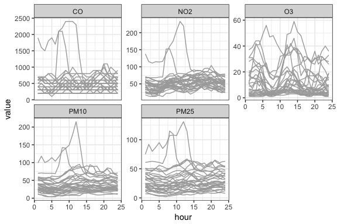

That's more like it!

For all pollutants except O3, I see big spikes during the middle of the day. Did these all occur on the same day?

I know PM10 was extremely high that month, so if I can identify the day with the highest PM10 spike, is that the same day as the big spikes for PM25, NO2 and CO?

Highlight a single line
=======================

When did PM10 pollution spike?

We need to create a new data frame for the day of with the highest PM10 value.

``` r
# Dec 2016 particulate data
dec2016_pm <- dec2016 %>%
  filter(pollutant %in% c('PM10', 'PM25'))

# find index of max value in Dec
max_val <- which.max(dec2016_pm[,'value'])

# find date
max_date <- dec2016_pm[max_val, 'date']

# filter on this date
dec2016_pm_max <- dec2016 %>%
  filter(date == max_date)
```

------------------------------------------------------------------------

Then we will create another `geom_line()` layer using the data for this PM10 spike day.

``` r
# create geom layer for day of PM10 spike
p.spike_day <- geom_line(data = dec2016_pm_max, aes(hour, value,
                                                     colour = pollutant))

# add on top of the Dec 2016 spaghetti plot
p.dec16 +
  p.spike_day +
  fw
```


``` r
# add context: bring back the threshold lines
p.dec16 +
  p.spike_day +
  fw +
  hl
```


Analysis conclusion & follow up
===============================

The plots show that on the day PM10 reached its maximum value for December 2016, PM25, NO2, and CO also reached their peak values for the month. This suggests that those pollutants are positively correlated, especially PM25.

In terms of severity:

-   CO's peak remained within 'very low'
-   NO2's peak got up to 'high'
-   PM10 and PM25 surged into 'very high'

Ideas to follow up:

-   Look at correlations between the variables using `ggpairs()`
-   Find out which months and which hours have the lowest pollution levels using `geom_tile()`
-   Calculate statistical significance of the max daily peak vs usual daily peak.

Ggplot2 recap
=============

To visualize groups:

-   use tidy dataframes
-   map grouping variables to `aes()`
-   use `facet_wrap` & `facet_grid`

To iterate quickly:

-   update data layer with `%+%`
-   save frequently-used layers as variables

Learn more
==========

Much of the data munging I did for this presention used the tidyr and dplyr from the `tidyverse` package. This slide show by Garret Grolemund is one of the best slide tutorials I've ever seen.

-   Data wrangling with Dplyr & Tidyr: <https://s3.amazonaws.com/udacity-hosted-downloads/ud651/DataWranglingWithR.pdf>

I referred to these quite frequently:

-   Ggplot2 cheatsheet: <http://www.rstudio.com/wp-content/uploads/2015/03/ggplot2-cheatsheet.pdf>

-   Online excerpts from *ggplot2: Elegant Graphics for Data Analysis (Use R!)* by Hadley Wickham is how, among other things, I learned about the magical `%+%` operator: <http://ggplot2.org/book/>

I have not looked at this book yet, but it is often recommended by Ggplot2 gurus.

-   The *R Graphics Cookbook* by Winston Chang <http://www.cookbook-r.com/Graphs/>
